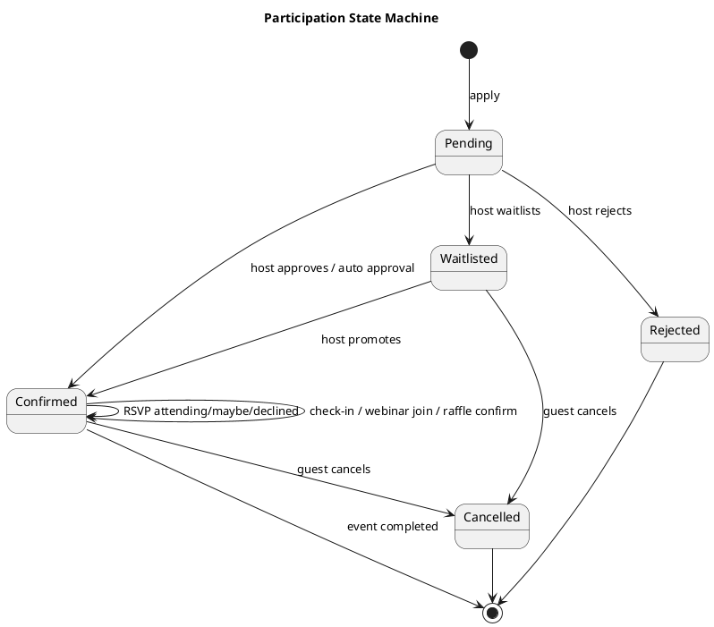

# imin Architecture For AI-Led Development

Date: 2026-05-24
Status: Draft
Audience: PMs, designer, and AI coding agents

## Why This Exists

imin is being built by a hackathon team without a human engineer. That is possible, but only if the product is designed so AI agents can make small, predictable changes without accidentally breaking the system.

The goal of this architecture is not to be enterprise-perfect. The goal is to make the app stable enough that PMs and designers can keep extending it with AI while preserving clear product boundaries.

## Architecture Principles

1. Keep the system small enough to understand in one sitting.
2. Prefer one clear domain model over many one-off feature states.
3. Add features by extending domain actions, not by creating new isolated APIs.
4. Keep Vercel Hobby's 12 Serverless Functions limit as a hard product constraint.
5. Make every host/admin action auditable.
6. Separate guest experience from host operations.
7. Treat "presence" as a domain concept, not as one feature's implementation detail.
8. Make local development work without cloud APIs.
9. Document decisions before adding broad new capabilities.

## Product Domains

imin should be organized around a few stable product domains.

| Domain | Owns | Examples |
| --- | --- | --- |
| Event | The thing being hosted | title, schedule, venue, mode, visibility, capacity |
| Profile | Who the participant is operationally | real name, LINE profile, company, role, interests |
| Participation | A user's relationship to an event | pending, confirmed, waitlisted, RSVP, check-in |
| Presence | Proof that a user is currently participating | GPS/check-in, heartbeat, webinar join, active session |
| Interaction | Live event activity | Q&A, poll, raffle confirmation, wall message |
| Messaging | Operational communication | application notice, approval, reminder, reconfirmation |
| Reporting | Data after or during event | CSV, attendance summary, engagement segments |

New features should first answer: which domain does this belong to?

If a feature does not fit any domain, pause and update this document before implementing.

## Target System Shape

```plantuml
@startuml
title imin Target Architecture

actor Guest
actor Host
actor Staff

rectangle "React App" {
  rectangle "Guest Surfaces" {
    Guest --> (Event Detail)
    Guest --> (Application Status)
    Guest --> (RSVP Reconfirmation)
    Guest --> (Live Participation)
  }

  rectangle "Host Surfaces" {
    Host --> (Event Create)
    Host --> (Event Manage)
    Host --> (Roster / Applicants)
    Host --> (Reports)
  }

  rectangle "Staff Surfaces" {
    Staff --> (Check-in)
    Staff --> (Live Monitor)
  }
}

rectangle "Vercel API <= 12 functions" {
  (Event API) --> (Redis)
  (Presence API) --> (Redis)
  (Messaging Webhook) --> (LINE)
}

(Event Detail) --> (Event API)
(Event Manage) --> (Event API)
(RSVP Reconfirmation) --> (Event API)
(Check-in) --> (Presence API)
(Live Participation) --> (Presence API)

database "Upstash Redis" as Redis
cloud "LINE LIFF / OA" as LINE

@enduml
```

## Route Boundaries

Routes should map to product jobs, not implementation history.

| Route | Job |
| --- | --- |
| `/` | Event home and entry point |
| `/events/new` | Create event |
| `/events/:eventId` | Guest-facing event invitation/detail |
| `/events/:eventId/manage` | Host-facing event operations |
| `/events/:eventId/checkin` | Event-scoped check-in |
| `/events/:eventId/live` | Webinar/live participation surface |
| `/checkin` | Legacy hackathon check-in until migrated |
| `/admin` | Legacy raffle/admin until migrated |

Important rule:

Guest-facing event detail should not become the full admin console. Host operations can be linked from detail, but should move into `/manage` as they grow.

## API Strategy

Because of the Vercel Hobby limit, avoid creating a new `api/*.ts` file for every feature.

Preferred pattern:

- Keep event lifecycle under `api/events.ts`.
- Use `action` to distinguish operations.
- Keep presence/live session under existing presence-related API files where possible.
- Add a new serverless file only when the domain boundary is truly different and the 12-function budget still allows it.

Suggested `api/events.ts` action groups:

| Action | Purpose |
| --- | --- |
| `create-event` or default POST | Create event |
| `participation` | Apply, approve, waitlist, reject, RSVP |
| `participation-note` | Host memo |
| `participation-history` | Decision audit trail |
| `message-log` | Record sent/planned messages |
| `event-report` | Aggregate event stats |

Before adding an API file, run:

```bash
find api -maxdepth 1 -type f -name '*.ts' | wc -l
```

The count must stay `<= 12`.

## Data Model Direction

### Event

Event is the root object. Most other records should point to an `eventId`.

```ts
interface EventRecord {
  id: string
  title: string
  category: 'meetup' | 'conference' | 'party' | 'wedding'
  eventType: 'offline' | 'online' | 'hybrid'
  visibility: 'public' | 'private' | 'internal'
  approvalMode: 'auto' | 'manual'
  capacity?: number
  hostUserId: string
  startsAt: string
  endsAt?: string
}
```

### Participation

Participation is the most important expansion point. Avoid creating separate RSVP, waitlist, check-in, and webinar attendance records unless there is a strong reason.

```ts
interface EventParticipation {
  eventId: string
  userId: string
  profileSnapshot: ProfileSnapshot
  applicationStatus: 'pending' | 'confirmed' | 'waitlisted' | 'rejected' | 'cancelled'
  rsvpStatus?: 'attending' | 'maybe' | 'declined'
  checkInStatus?: 'not_arrived' | 'arrived' | 'checked_in' | 'no_show'
  webinarStatus?: 'not_joined' | 'joined' | 'left_early' | 'completed'
  companions: number
  message?: string
  hostMemo?: string
  history: ParticipationHistory[]
  createdAt: number
  updatedAt: number
}
```

### Presence

Presence answers: is this person actively participating right now?

It can be based on:

- check-in
- heartbeat
- GPS/GeoIP when required
- webinar live join
- recent interaction

Do not hard-code presence as only GPS or only webinar join.

## State Machine

Participation should behave like a state machine.



AI agents should not add new participation statuses without updating this diagram and the product brief.

## Frontend Component Boundaries

Current implementation may still be compact, but future growth should move toward these boundaries.

Suggested structure:

```text
src/
  domains/
    events/
      api.ts
      types.ts
      localStore.ts
      EventDetailPage.tsx
      EventCreatePage.tsx
      EventManagePage.tsx
    profile/
      types.ts
      ProfileSheet.tsx
    presence/
      types.ts
      useHeartbeat.ts
    raffle/
      types.ts
      RafflePage.tsx
  shared/
    ui/
    date.ts
```

Rule of thumb:

- Page components orchestrate.
- Domain API files handle fetch/local fallback.
- Type files define shared domain contracts.
- Shared UI components must not know business rules.

## AI Coding Workflow

Every AI-led feature should follow this sequence:

1. Read `docs/product/imin-product-brief.md`.
2. Identify the domain: Event, Profile, Participation, Presence, Interaction, Messaging, Reporting.
3. Check whether the feature changes a state machine.
4. Check whether the feature needs a new API action or can reuse an existing one.
5. Check Vercel function count.
6. Implement the smallest useful slice.
7. Run build and focused browser QA.
8. Update docs/release QA and code review notes for meaningful changes.
9. Commit locally.
10. Push only when the user explicitly asks.

## Feature Intake Template

Use this before asking AI to implement a new capability.

```md
### Feature

What should users be able to do?

### User

Host / Guest / Staff / Internal Host

### Domain

Event / Profile / Participation / Presence / Interaction / Messaging / Reporting

### State Changes

What records or statuses change?

### UI Surface

Which route/page owns this?

### API Impact

Existing action or new action?

### Acceptance

How do we know it works?

### Non-Goals

What should not be built yet?
```

## Red Flags For AI Implementation

Stop and reconsider if an AI change:

- adds a new `api/*.ts` file without checking the 12-function limit
- creates a second RSVP model separate from Participation
- stores host-only actions only in client state
- mixes guest invitation UI and host console into one crowded screen
- adds event-specific logic inside shared UI components
- changes attendance/presence meaning without updating docs
- introduces a new dependency for a simple UI or data task
- edits generated build artifacts as if they were source

## Near-Term Architecture Priorities

1. Move event management into `/events/:eventId/manage`.
2. Make Participation the single source of truth for application, approval, RSVP, and check-in status.
3. Add host action history before adding bulk operations.
4. Define Presence so offline and webinar scenarios can share raffle eligibility.
5. Keep the app deployable under Vercel Hobby constraints.

## Open Architecture Questions

- Should internal ly identity come from LINE, internal directory, or manual profile?
- Should Redis remain the primary store after MVP, or should events move to a relational database?
- How should delegated staff permissions work?
- Which live interactions belong in imin versus external chat tools?
- What is the minimum privacy model for internal event analytics?
