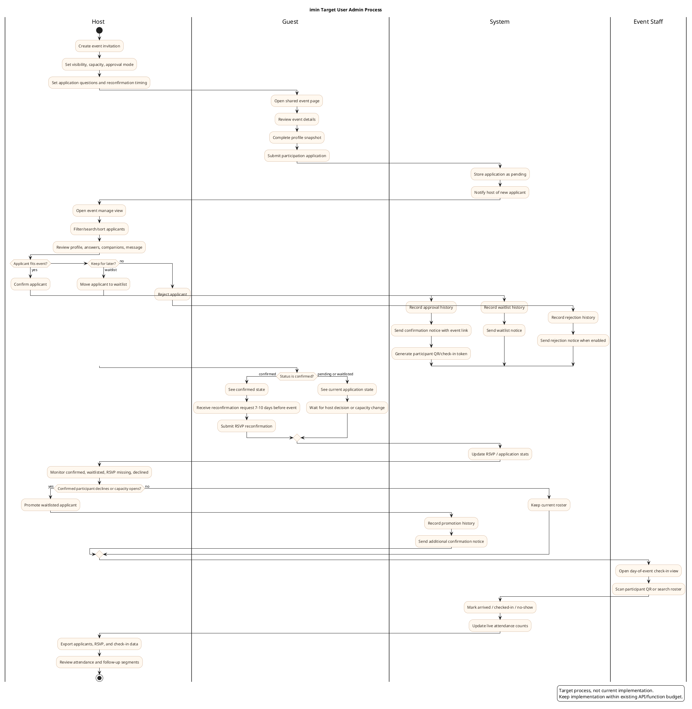

# Eventus User Admin Benchmark And imin Plan

Date: 2026-05-23
Scope: 이벤터스의 참가자/사용자 관리자 기능을 공개 자료 기준으로 벤치마킹하고, imin 행사 관리 기능의 수정 계획안을 정리한다.

Related product brief: [imin-product-brief.md](./product/imin-product-brief.md)

## Sources

- 이벤터스 플랜 소개: https://event-us.kr/hostcenter/plan
- 이벤터스 호스트 가이드북 검색 결과: https://eventwithus.notion.site/bfac6c5fd45348cda8454175770870d6
- 이벤터스 블로그, 참가자 경험 기반 행사 준비: https://event-us.kr/hostcenter/blog/379/event-solution
- 이벤터스 채용/서비스 소개 Notion 검색 결과: https://eventwithus.notion.site/21720cee823780df852cdf89c06cecdb
- 공개 행사 페이지 예시: https://event-us.kr/basecampus/event/104870

## Benchmark Summary

이벤터스의 사용자 관리자 기능은 단순한 신청자 목록이 아니라 `모집 -> 안내 -> 현장 입장 -> 참여 -> 사후 분석`으로 이어지는 참가자 운영 파이프라인에 가깝다. 공개 자료에서 확인되는 핵심은 다음과 같다.

| Area | Eventus Pattern | imin Implication |
| --- | --- | --- |
| 사전 신청 관리 | 무료 플랜부터 행사 게시와 참가자 사전 신청 관리를 제공한다. | imin의 `참여 신청`은 맞는 방향이다. 다음 단계는 목록 UX와 운영 액션이다. |
| RSVP | 스탠다드 플랜에서 참석 여부 확인을 제공하고, RSVP 메일을 통해 참석 예측을 지원한다. | imin은 이미 `승인 후 RSVP 재확인` 모델을 잡았으므로, 리마인드 시점/대상 세그먼트를 추가해야 한다. |
| 자동 안내 | 신청 완료/취소/리마인드 이메일 커스텀, 문자 예약 발송, 템플릿 활용이 언급된다. | LINE 기반 제품답게 LINE 메시지 템플릿과 이메일/전화 fallback을 분리 설계한다. |
| 참가자 데이터 | 신청부터 행사 종료까지 데이터를 통합 관리하고, 참가자별 유입 경로/API 연동을 상위 플랜 기능으로 둔다. | 초기에는 CSV export와 유입 경로 필드부터, 이후 API/Webhook으로 확장한다. |
| 현장 운영 | QR 체크인, 명찰 출력, 출석 체크, 등록데스크 운영 효율화가 강조된다. | 기존 imin 체크인 기능과 행사 참가자 DB를 연결하면 강점이 된다. |
| 사후 관리 | 만족도/사후 설문, 문서 발급, 출석/세션/설문 데이터를 대시보드로 본다. | MVP에는 사후 설문 요청과 출석자 필터만 넣고, 문서 발급은 후순위로 둔다. |
| 채널/호스트 | 채널, 신청 행사, 관심 행사, 구독 채널 등 호스트/참가자 관계가 분리되어 있다. | imin의 프로필 관심사 설정은 행사 추천/자동 알림과 연결하기 좋다. |

## Current imin Gap

현재 imin은 이벤트 상세에서 호스트가 신청자를 `확정/대기/거절`로 바꿀 수 있고, 확정 참가자가 RSVP 재확인을 할 수 있다. 다만 운영자가 실제로 쓰기에는 아직 아래가 비어 있다.

- 신청자 목록이 카드형 단일 목록이라 검색, 필터, 정렬, 대량 처리가 어렵다.
- 신청자 상세 정보가 이름/메시지/동반 인원 중심이라 이메일, 전화번호, 회사, 관심사 같은 운영 필드와 연결되지 않는다.
- 승인/대기/거절 변경 이력이 남지 않는다.
- 확정자에게 언제, 어떤 문구로 재확인을 보낼지 설정할 수 없다.
- 신청자 데이터를 내보내거나 현장 체크인 결과와 대조할 수 없다.
- 호스트 권한 검증이 클라이언트 신뢰에 가깝다. 실제 운영에는 서버 측 host check가 필요하다.

## Proposed Product Direction

imin은 이벤터스의 대형 컨퍼런스 관리자 콘솔을 그대로 따라가기보다, `모바일 초대장 + 가벼운 호스트 운영 도구`로 재해석하는 것이 맞다. 즉 첫 화면은 초대장/행사 상세이고, 호스트에게만 필요한 관리 기능은 상세 안의 관리 탭 또는 별도 `/events/:id/manage`로 분리한다.

핵심 원칙:

- 게스트는 간단해야 한다: 신청, 상태 확인, 확정 후 RSVP 재확인.
- 호스트는 빠르게 판단해야 한다: 신청자 프로필, 메시지, 동반 인원, 관심사/회사 정보, 상태 변경.
- 운영 액션은 기록되어야 한다: 승인자, 변경 시각, 메시지 발송 여부.
- Vercel Hobby 제약을 유지한다: 새 Serverless Function을 늘리지 않고 `api/events.ts` 액션을 확장한다.

## Target User Admin Process

PlantUML source: [imin-user-admin-process.puml](./diagrams/imin-user-admin-process.puml)

이 프로세스는 현재 코드가 아니라 imin이 지향해야 하는 운영 시나리오다. 핵심은 게스트의 경험을 `신청 -> 상태 확인 -> 확정 후 RSVP 재확인`으로 단순하게 유지하고, 호스트의 경험은 `신청자 검토 -> 승인/대기/거절 -> 재확인 요청 -> 현장 체크인 -> 사후 데이터`로 이어지게 만드는 것이다.



## Modification Plan

### Phase 1 - Host Applicant Console

Goal: 현재 카드형 신청자 관리를 실제 운영 목록으로 만든다.

- `/events/:id/manage` 또는 상세 내 `관리` 탭 추가
- 상태 탭: 전체, 승인 대기, 확정, 대기자, 거절, 취소
- 검색: 이름, 회사, 이메일, 전화번호, 신청 메시지
- 정렬: 신청순, 최근 변경순, 동반 인원순
- 신청자 상세 패널: 프로필, 신청 메시지, 동반 인원, RSVP 상태, 변경 이력
- 빠른 액션: 확정, 대기, 거절, 취소, 메모 추가
- 집계 바: 신청 n명, 확정 n명, 대기 n명, RSVP 참석/고민/불참

Acceptance:

- 호스트가 30명 이상의 신청자를 모바일에서도 필터링하고 상태 변경할 수 있다.
- 상태 변경 후 목록, 상세, 홈 카드 통계가 즉시 일관되게 갱신된다.

### Phase 2 - Participant Profile And Application Fields

Goal: 참가자 판단에 필요한 최소 운영 정보를 모은다.

- 프로필 설정의 실명, 이메일, 전화번호, 회사, 역할, 관심사를 신청 payload에 스냅샷으로 저장
- 행사별 신청 질문 추가: 단답, 장문, 선택형
- 공개 행사 기본 질문 preset: 참가 목적, 관심 주제, 동반 여부
- 신청 시 개인정보 표시/동의 문구 추가

Acceptance:

- 호스트는 신청자 목록에서 회사/역할/관심사를 보고 승인 판단을 할 수 있다.
- 게스트가 프로필을 바꿔도 당시 신청 정보는 운영 기록으로 유지된다.

### Phase 3 - Reconfirmation And Messaging

Goal: 이벤터스의 RSVP/리마인드 운영을 LINE 친화적으로 구현한다.

- 행사 생성 시 재확인 요청 시점 설정: 7일 전, 10일 전, 직접 선택
- 대상 세그먼트: 확정자 전체, RSVP 미응답자, 고민 중, 대기자
- 메시지 템플릿: 신청 완료, 확정, 대기, 거절, RSVP 재확인, 행사 전날 안내
- 발송 로그: 대상, 채널, 시각, 성공/실패
- 초기 구현은 실제 자동 발송 전 `발송 예정 목록`과 수동 발송 버튼으로 시작

Acceptance:

- 호스트가 확정자 중 RSVP 미응답자만 골라 재확인 요청을 보낼 수 있다.
- 대기자는 확정자 취소/불참 시 추가 안내 대상이 된다.

### Phase 4 - Check-in Linkage

Goal: 기존 imin 체크인 기능을 행사 참가자 관리와 연결한다.

- 확정 참가자별 QR/체크인 토큰 발급
- 행사 당일 `확정자`, `대기자 현장 승인`, `현장 등록` 구분
- 체크인 상태: 미도착, 도착, 입장 완료, 노쇼
- 호스트 화면에 현장 카운터 표시

Acceptance:

- 확정 참가자 목록과 현장 체크인 목록이 같은 데이터 흐름을 사용한다.
- RSVP 불참/노쇼 데이터를 다음 행사 운영 판단에 남길 수 있다.

### Phase 5 - Export And Analytics

Goal: 운영자가 행사 후 데이터를 가져갈 수 있게 한다.

- CSV export: 신청자, 확정자, RSVP, 체크인
- 간단 대시보드: 신청 전환, 확정률, RSVP 응답률, 출석률
- 유입 경로 필드: share URL query 또는 referrer 저장
- 사후 설문 링크 및 응답 여부 필드

Acceptance:

- 호스트가 행사 후 신청자와 참석자 데이터를 한 번에 내려받을 수 있다.
- 다음 행사에 쓸 수 있는 최소 지표가 남는다.

## Data Model Sketch

Keep this inside `api/events.ts` to preserve the current 12-function deployment limit.

```ts
type ApplicationStatus = 'pending' | 'confirmed' | 'waitlisted' | 'rejected' | 'cancelled'
type RsvpStatus = 'attending' | 'maybe' | 'declined'
type CheckInStatus = 'not_arrived' | 'arrived' | 'checked_in' | 'no_show'

interface EventParticipation {
  eventId: string
  userId: string
  displayName: string
  realName?: string
  email?: string
  phone?: string
  company?: string
  role?: string
  interests?: string[]
  applicationStatus: ApplicationStatus
  rsvpStatus?: RsvpStatus
  checkInStatus?: CheckInStatus
  companions: number
  message?: string
  answers?: Record<string, string>
  hostMemo?: string
  history?: ParticipationHistory[]
  createdAt: number
  updatedAt: number
}
```

Suggested API actions:

- `GET /api/events?action=participation&eventId=...`
- `POST /api/events` with `action=participation`
- `POST /api/events` with `action=participation-note`
- `POST /api/events` with `action=participation-bulk-update`
- `POST /api/events` with `action=message-log`
- `POST /api/events` with `action=checkin`

## Recommended Next Implementation Slice

가장 먼저 할 일은 Phase 1이다. 지금 사용자 피드백의 중심이 “공개 행사 신청자는 먼저 신청하고, 호스트가 보고 확정해야 한다”였기 때문이다.

Next slice:

1. `/events/:id/manage` 호스트 관리 화면 추가
2. 신청자 상태 필터/검색/정렬 추가
3. 신청자 상세 패널과 호스트 메모 추가
4. 상태 변경 이력 저장
5. GSD QA: 모바일 390px, 데스크톱 1280px, API 함수 12개 유지, 빌드 통과

Non-goals for this slice:

- 결제/보증금/환불
- 명찰 출력
- 문서 발급
- 완전 자동 메시지 스케줄러
- 외부 데이터 API

## Risks And Decisions

- 개인정보 저장 범위: 이메일/전화번호는 편리하지만 민감하다. 저장 전 표시/동의 문구가 필요하다.
- LINE 메시지 발송: 실제 발송은 비용과 권한 문제가 있으므로 먼저 템플릿/대상/로그 UI를 만들고, 발송은 수동 트리거로 시작한다.
- 권한: 호스트 전용 관리 화면은 서버에서도 `event.hostUserId === userId`를 검증해야 한다.
- 제품 포지션: 이벤터스처럼 엔터프라이즈 운영 도구가 아니라, 작은 모임부터 쓸 수 있는 가벼운 운영 도구로 유지한다.
