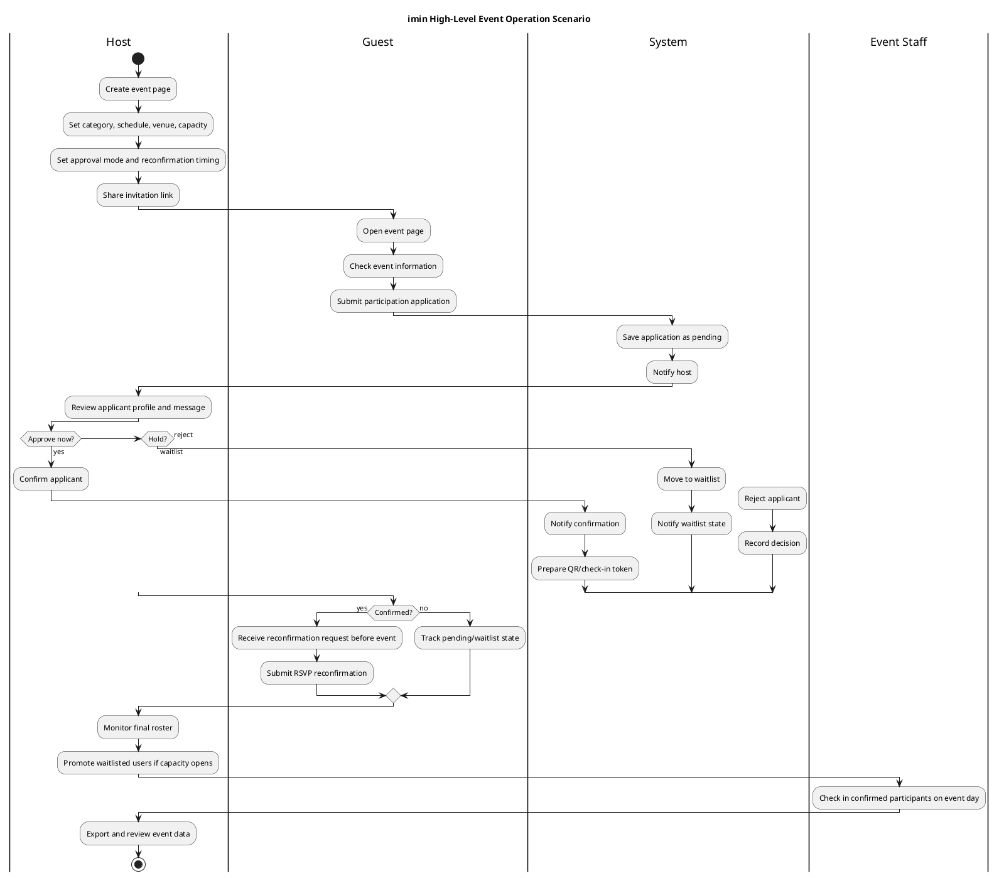

# imin Product Brief

Date: 2026-05-23
Status: Draft

Related architecture: [ai-development-architecture.md](../architecture/ai-development-architecture.md)

## One Sentence

imin은 작은 모임부터 공개 밋업, 웨비나까지, 호스트가 모바일 초대장을 만들고 참여 신청자/확정자/실시간 참석자를 끝까지 관리할 수 있게 해주는 LINE 기반 이벤트 운영 도구다.

## Product North Star

사람들이 "나 이 행사 갈게"라고 말하는 순간부터, 호스트가 "누가 올 수 있고, 누가 실제로 왔는지"를 놓치지 않게 만든다.

imin의 핵심은 예쁜 초대장 자체가 아니다. 초대장은 입구이고, 진짜 제품 가치는 그 뒤의 운영 흐름에 있다.

- 게스트는 행사 정보를 보고 쉽게 신청한다.
- 호스트는 신청자를 보고 확정/대기/거절한다.
- 확정자는 행사 전 참석 여부를 다시 확인한다.
- 호스트는 대기자를 승격하거나 최종 인원을 조정한다.
- 행사 당일에는 확정자와 실시간 참석을 연결한다.
- 행사 후에는 신청, RSVP, 체크인 데이터를 다음 운영에 쓴다.

## Problem Statements

### Voice Of Hosts

아래 quote는 서비스 제공자의 마케팅 문구가 아니라, 행사 리더/호스트/운영자가 실제로 말한 불편과 효용이다. 이 문서의 문제 statement는 기능 카탈로그가 아니라 이런 운영자 언어를 기준으로 검증되어야 한다.

| Source | Host Quote | Signal For imin |
| --- | --- | --- |
| [RSVPify customer quote](https://rsvpify.com/guest-list-management/) | "see numbers of who responded, who has not yet responded" | 호스트는 예쁜 초대장보다 응답/미응답 현황을 한눈에 봐야 한다. |
| [RSVPify customer quote](https://rsvpify.com/guest-list-management/) | "communicating all in one spot" | 신청자/확정자/미응답자 커뮤니케이션이 흩어지는 것이 실제 pain이다. |
| [RSVPify customer quote](https://rsvpify.com/guest-list-management/) | "saved us admin time" | 목표는 화려한 콘솔이 아니라 호스트의 운영 시간을 줄이는 것이다. |
| [RSVPify customer quote](https://rsvpify.com/guest-list-management/) | "manage RSVPs on an individual level" | 동반/가족/그룹 안에서도 개인별 상태 관리가 필요하다. |
| [Reddit r/events host thread](https://www.reddit.com/r/events/comments/1t4eq8m/advice_on_how_people_manage_events_with_large/) | "Chasing people for replies" | RSVP/재확인 요청은 호스트가 반복해서 손으로 쫓아다니는 일이다. |
| [Reddit r/events host thread](https://www.reddit.com/r/events/comments/1t4eq8m/advice_on_how_people_manage_events_with_large/) | "Not knowing final numbers" | 최종 인원 불확실성이 정원, 장소, 음식, 대기자 운영의 핵심 리스크다. |
| [Reddit r/events host thread](https://www.reddit.com/r/events/comments/1t4eq8m/advice_on_how_people_manage_events_with_large/) | "Plus-ones getting confusing" | 동반 인원은 단순 숫자가 아니라 명단/정원/체크인에 영향을 준다. |
| [Reddit r/events host thread](https://www.reddit.com/r/events/comments/1t4eq8m/advice_on_how_people_manage_events_with_large/) | "Last-minute dropouts" | 대기자 승격과 행사 전 재확인은 실제 운영 문제를 해결하기 위한 기능이다. |
| [Whova organizer quote](https://whova.com/trade-show-app-lead-retrieval/lead-retrieval-app/) | "scan their QR code" | 현장 참여는 QR/체크인 같은 즉시 검증 가능한 접점과 연결되어야 한다. |
| [Whova organizer quote](https://whova.com/trade-show-app-lead-retrieval/lead-retrieval-app/) | "straight from your phone" | 호스트와 스태프의 현장 운영 도구는 모바일에서 바로 작동해야 한다. |
| [Whova organizer quote](https://whova.com/trade-show-app-lead-retrieval/lead-retrieval-app/) | "track who they spoke to" | 현장 상호작용은 사라지는 순간이 아니라 추적 가능한 이벤트 데이터가 되어야 한다. |
| [Whova organizer quote](https://whova.com/trade-show-app-lead-retrieval/lead-retrieval-app/) | "keep track of who is attending" | 래플 대상은 등록자 전체가 아니라 실제 참석/참여가 확인된 사람이어야 한다. |

### P1. Event hosts lose control when "RSVP" is treated as attendance approval.

공개 행사에서 참석 버튼을 누르는 것과 실제 참가 확정은 다르다. 호스트는 공간, 정원, 분위기, 대상 적합성, 동반 인원, 노쇼 위험을 보고 신청자를 확정해야 한다. 그런데 많은 가벼운 초대장 도구는 RSVP를 첫 액션으로 두기 때문에, 호스트 입장에서는 "누가 신청했는지"와 "누가 와도 되는지"가 섞인다.

imin should separate:

- application: 참가하고 싶다는 요청
- approval: 호스트가 참가 가능하다고 판단한 상태
- RSVP reconfirmation: 확정자가 행사 전 실제 참석 여부를 다시 알려주는 상태

### P2. Small event hosts do not have a lightweight operating console.

작은 밋업이나 커뮤니티 행사는 이벤터스 같은 전문 행사 플랫폼을 쓰기에는 무겁고, 카카오톡/LINE/스프레드시트로 관리하기에는 금방 흩어진다. 신청자는 채팅방에 있고, 확정자는 스프레드시트에 있고, 최종 참석 여부는 DM에 있고, 현장 체크인은 또 따로 관리된다.

imin should give hosts one compact place to:

- see applicants
- approve, waitlist, reject
- request reconfirmation
- promote waitlisted people
- check people in on event day
- export or review the final roster

### P3. Guests need clarity without becoming event administrators.

게스트는 복잡한 상태와 관리 기능을 보고 싶지 않다. 그들이 알고 싶은 것은 단순하다. "내가 신청했나?", "확정됐나?", "언제 어디로 가면 되나?", "못 가게 되면 어떻게 바꾸나?"이다. 상태가 불명확하면 게스트는 호스트에게 개별 메시지를 보내고, 그 순간 운영 부담이 다시 호스트에게 돌아간다.

imin should show guests only the next meaningful action:

- apply
- wait for decision
- confirm final attendance
- check in

### P4. Waitlists are operational assets, not just rejected overflow.

대기자는 단순히 "못 오는 사람들"이 아니다. 확정자가 불참하거나 정원이 늘어났을 때 바로 초대할 수 있는 후보군이다. 하지만 대기자가 별도 메모나 채팅으로만 관리되면, 호스트는 누가 우선순위인지, 누구에게 연락했는지, 누가 승격됐는지 놓치기 쉽다.

imin should make waitlist movement explicit:

- waitlisted status
- promotion history
- notification state
- capacity-aware roster updates

### P5. Day-of-event attendance is disconnected from pre-event intent.

사전 신청과 행사 당일 체크인이 분리되면, 호스트는 "신청한 사람", "확정한 사람", "오겠다고 재확인한 사람", "실제로 온 사람"을 비교할 수 없다. 그러면 다음 행사의 정원 설정, 노쇼 예측, 대기자 운영이 감으로 남는다.

imin should connect:

- application data
- approval data
- RSVP reconfirmation
- check-in/presence
- post-event export and analytics

### P6. Live raffles are only fair and useful when presence is verified.

imin의 원래 차별점은 "지금 참여 중인 사람만" 대상으로 삼는 것이었다. 오프라인에서는 이것이 현장에 있는 사람이고, 웨비나에서는 라이브 세션에 접속해 있고 반응 가능한 사람이다. 일반적인 온라인 추첨은 등록만 해도 대상이 되거나, 링크만 받은 사람도 참여할 수 있다. 하지만 라이브 이벤트에서 래플은 단순 경품 추첨이 아니라 참석자에게 지금 이 순간 참여 중이라는 보상과 긴장감을 주는 engagement 장치다. 이때 호스트가 가장 피하고 싶은 것은 실제로 참여하지 않는 사람이 당첨되거나, 당첨자가 응답하지 않아 진행 흐름이 끊기는 상황이다.

imin should make raffle eligibility depend on:

- confirmed participation
- day-of-event check-in or live session join
- live heartbeat/presence
- location verification when required for offline events
- session activity verification for webinars
- winner confirmation within a short time window

### P7. Webinars need proof of live attention, not just registration.

웨비나는 신청과 실제 시청 사이의 간극이 크다. 등록자는 많아도 라이브에 들어오지 않거나, 들어와도 중간에 이탈하거나, 화면만 켜둔 채 반응하지 않을 수 있다. 호스트 입장에서는 "등록자 수"보다 "실제로 들어왔는지", "끝까지 있었는지", "중간에 반응했는지", "후속 연락할 가치가 있는지"가 중요하다.

imin should support webinar hosts with:

- confirmed registration
- live join status
- heartbeat-based attendance
- poll/Q&A/raffle interaction signals
- attendance duration or session checkpoints
- post-webinar follow-up segments

## Why Not Google Forms, Calendar RSVP, And Chat?

For ly internal webinars, the real alternative is not Eventus. It is the existing lightweight stack:

- Google Form for registration
- Google Calendar RSVP for attendance intent
- Meet/Zoom/LINE/Slack chat for live communication
- chat or docs for Q&A
- spreadsheet export for after-the-fact cleanup

This stack is good enough when the event is simple and the host only needs a rough headcount. imin should not replace it for every webinar.

imin becomes worth using when the event needs verified participation and operational continuity.

| Existing Tool | What It Handles Well | Where It Breaks For Hosts | What imin Adds |
| --- | --- | --- | --- |
| Google Form | Collects registrations and custom answers | Registration is not approval, attendance, or engagement. Follow-up work moves to sheets/manual messages. | Application, approval, RSVP, attendance, and engagement become one participation record. |
| Google Calendar RSVP | Captures intent to attend | Calendar RSVP does not prove live attendance, attention, or raffle eligibility. It also does not model waitlist/approval well. | RSVP becomes one state in a larger flow, connected to live join/check-in and winner confirmation. |
| Webinar chat | Enables real-time communication | Chat scrolls away, questions mix with reactions, and participation data is hard to summarize. | Q&A, poll, raffle, and heartbeat can become structured engagement signals. |
| Spreadsheet | Flexible after-the-fact cleanup | Manual reconciliation across form/calendar/chat/check-in is slow and error-prone. | The roster is updated as the event runs, with export as an output rather than the operating surface. |

The product claim is not:

"imin has a form, calendar, and chat too."

The product claim is:

"imin connects application, approval, RSVP, live presence, interaction, raffle eligibility, and post-event reporting into one verified participation timeline."

Use imin when at least one of these is true:

- The host needs to know who actually attended, not only who registered.
- The host wants to run a fair raffle among live participants.
- The event has limited capacity, waitlist, or approval needs.
- The host needs post-event segments: attended, no-show, interacted, won, asked a question.
- The event should produce a reusable participation record for future internal events.
- The organizer wants less spreadsheet reconciliation after the event.

Do not use imin when:

- The webinar is a simple broadcast.
- No approval, attendance proof, raffle, or follow-up segmentation is needed.
- Calendar RSVP is enough for the host's decision-making.

## Background

초기 imin은 Tech Week Hackathon용 "지금 여기 있는 사람만 인증한다"는 현장 인증 앱이었다. LINE LIFF, GeoIP, GPS, 실시간 active user, raffle 기능이 중심이었다.

이후 제품 방향은 `모바일 청첩장 같은 정보 설계`를 참고한 행사 플랫폼으로 확장됐다. 여기서 "결혼식"은 기본 카테고리가 아니라 좋은 초대장/참석 관리 UX의 레퍼런스다. 기본 관점은 누구나 쉽게 쓸 수 있는 밋업 도구다.

현재 제품은 다음 두 흐름을 함께 가진다.

- Event platform: 행사 생성, 공유, 참여 신청, 승인, RSVP 재확인
- Live operation: 오프라인 체크인, 온라인 세션 참여, presence, raffle, 참여 이벤트

장기적으로는 이 둘을 하나의 행사 운영 파이프라인으로 합치는 것이 목표다.

## Target Users

### Internal Company Host

ly 사내에서 올핸즈, 타운홀, 웨비나, 워크숍, 사내 밋업, 해커톤, 교육 세션, 네트워킹 이벤트를 여는 조직/운영자다.

Needs:

- 사내 구성원에게 빠르게 행사 정보를 배포하고 싶다.
- 부서, 직무, 조직, 관심사 기준으로 참석 신청과 안내를 관리하고 싶다.
- 참석자 규모를 예측하고 좌석/간식/회의실/온라인 송출 리소스를 준비하고 싶다.
- 실제 참석자, 라이브 참여자, 질문/투표/래플 참여자를 구분하고 싶다.
- 행사 후 참여율과 피드백을 다음 사내 행사 개선에 쓰고 싶다.

### Host

작은 밋업, 커뮤니티 모임, 회사 세미나, 웨비나, 네트워킹 행사, 파티, 결혼식 같은 이벤트를 여는 사람이다.

Needs:

- 몇 분 안에 모바일 행사 페이지를 만들고 싶다.
- 친구/참가자에게 링크로 쉽게 공유하고 싶다.
- 공개 행사라면 아무나 바로 참석 확정되는 것을 피하고 싶다.
- 신청자 목록을 보고 확정/대기/거절하고 싶다.
- 행사 며칠 전 실제 참석 여부를 다시 확인하고 싶다.
- 행사 당일 또는 라이브 세션에서 누가 실제로 참여했는지 알고 싶다.

### Guest

초대 링크를 받은 사람 또는 공개 행사 페이지를 본 사람이다.

Needs:

- 행사 정보, 시간, 장소, 준비물, 문의 방법을 빠르게 확인하고 싶다.
- 복잡한 계정 생성 없이 신청하고 싶다.
- 내 신청 상태를 알고 싶다.
- 확정 후 일정이 바뀌면 참석 여부를 수정하고 싶다.
- 행사 당일 입장/체크인 또는 라이브 세션 참여를 쉽게 하고 싶다.

### Event Staff

행사 당일 등록데스크, 현장 운영, 또는 웨비나 라이브 운영을 돕는 사람이다.

Needs:

- 확정자 명단을 빠르게 검색하고 싶다.
- QR 또는 이름으로 입장 처리하고 싶다.
- 대기자/현장 등록자를 구분하고 싶다.
- 현재 참석/접속/반응 현황을 즉시 보고 싶다.

## Product Principles

1. 초대장은 아름답게, 관리는 조용하고 빠르게
2. 공개 행사는 RSVP보다 참여 신청이 먼저
3. 참석 여부는 확정 이후의 재확인 도구
4. 대기자는 단순 상태가 아니라 운영 가능한 후보군
5. 라이브 래플은 등록자가 아니라 실제 presence가 확인된 사람을 대상으로 한다
6. 호스트 액션은 이력으로 남아야 한다
7. LINE 프로필은 시작점이고, 실명/연락처/회사/관심사는 별도 프로필로 관리한다
8. Vercel Hobby의 12 Serverless Functions 제한을 제품/기술 설계 제약으로 유지한다

## End-To-End Scenario

Detailed admin process source: [imin-user-admin-process.puml](../diagrams/imin-user-admin-process.puml)

## Information Architecture

### Internal Event Mode

- 사내 행사 홈
- 조직/팀/관심사 기반 행사 추천
- 사내 프로필 연동 또는 수동 프로필
- 비공개 사내 행사 링크
- 참석 신청/승인 또는 자동 확정
- 올핸즈/웨비나 live presence
- Q&A, poll, raffle
- 익명 질문 옵션
- 참석/참여 리포트

### Guest-Facing

- `/` event home
- `/events/:eventId` event invitation/detail
- profile sheet
- application status surface
- RSVP reconfirmation surface
- day-of-event check-in surface

### Host-Facing

- event creation
- my events
- event detail owner controls
- `/events/:eventId/manage` target admin surface
- applicant list and filters
- applicant detail
- message/reconfirmation controls
- check-in monitor
- export/analytics

### Legacy/Live Event

- `/checkin`
- `/raffle`
- `/admin`
- wall/Q&A/interaction surfaces

Long-term decision: legacy live-event tools should become event-scoped features instead of separate product islands.

## Core Domain Model

### Event

Represents a hosted gathering.

Important fields:

- title, description, category
- startsAt, endsAt, timezone
- eventType: offline, online, hybrid
- venue/online URL
- visibility: public, private/link-only
- approvalMode: auto, manual
- capacity
- host/co-host identity
- reconfirmation settings

### Profile

Represents participant-operational identity, separate from LINE nickname.

Important fields:

- LINE userId and picture
- realName
- email
- phone
- company
- role
- interests
- notification preferences

### Participation

Represents one user's relationship to one event.

Important fields:

- applicationStatus: pending, confirmed, waitlisted, rejected, cancelled
- rsvpStatus: attending, maybe, declined
- companions
- application message
- application answers
- host memo
- decision history
- checkInStatus
- createdAt/updatedAt/decidedAt/rsvpUpdatedAt

### Message Log

Represents operational communication.

Important fields:

- eventId
- target user/segment
- template type
- channel: LINE, email, SMS/manual
- status: planned, sent, failed
- sentAt

## Key Flows

### Internal ly Events

If imin is used for ly internal events, the product should become a lightweight operating layer for company gatherings, not just public meetups.

Representative event types:

- all-hands / town hall
- internal webinar
- onboarding or training
- team workshop
- hackathon / demo day
- culture event / party
- internal networking meetup

Internal events need a few different defaults:

- visibility defaults to private/internal
- approval can default to auto-confirm for broad company events
- host can still require approval for limited-capacity workshops
- profile fields should prioritize real name, org, team, role, office/location, interests
- attendance can mean physical check-in, webinar live join, or interaction with poll/Q&A/raffle
- reports should group by org/team/location when privacy rules allow it

Internal host workflow:

1. Create internal event
2. Select audience: all employees, org/team, office, role, interest group, invite-only
3. Choose mode: offline, webinar, hybrid
4. Set capacity and approval mode
5. Collect applications or auto-confirm attendees
6. Run live Q&A, poll, and presence-based raffle
7. Track attendance and engagement
8. Export summary for organizers

Important privacy stance:

- Individual attendance can be visible to event operators when needed for operations.
- Aggregated engagement should be preferred for broad internal reporting.
- Anonymous Q&A should be supported for sensitive company-wide events.
- Raffle eligibility should be explainable without exposing unnecessary personal data.

### Event Creation

The host creates a mobile invitation-style event page. The default category should be meetup, not wedding. Category presets can change starter copy, but should not imply a single use case.

Creation should optimize for data entry, not full-screen visual appreciation. The big invitation hero belongs mainly to the viewer/detail page.

### Participation Application

For public/manual events, guests apply first. An application is not attendance. It is a request to join.

Application includes:

- profile snapshot
- companions
- host-facing message
- event-specific answers
- privacy consent for operational contact fields

### Host Applicant Management

Host management is the next major surface. It should let hosts:

- filter by pending, confirmed, waitlisted, rejected, cancelled
- search by name, company, email, phone, message
- sort by application time, status update time, companions
- inspect detail
- add host memo
- approve, waitlist, reject, cancel
- see status history

### RSVP Reconfirmation

RSVP is only meaningful after confirmation. It is used for final attendance planning, usually 7-10 days before the event.

Host should be able to request reconfirmation for:

- all confirmed participants
- RSVP missing participants
- maybe participants
- waitlisted participants when capacity opens

### Waitlist Operations

Waitlist is not a dead-end state. It is an operating pool.

When a confirmed participant declines or capacity opens, the host should be able to promote waitlisted users. The system should record the promotion and send/prepare a confirmation notice.

### Day-Of Check-In

Check-in should connect to confirmed participants. Existing GeoIP/GPS/presence features become stronger when they are event-scoped.

Check-in states:

- not_arrived
- arrived
- checked_in
- no_show

### Webinar Attendance

Webinar support should reuse the same event/participation model, but change what "presence" means. Offline presence is physical check-in plus optional location verification. Webinar presence is session join plus continued activity.

For webinars, imin should track:

- session join
- heartbeat while the live page is open
- poll, Q&A, comment, or raffle interaction
- minimum attendance checkpoints
- drop-off or no-show state

Webinar-specific host actions:

- approve registrants before sending the live link
- show live attendee count
- segment attendees by attended, no-show, left early, interacted
- run raffle among live and responsive attendees
- export webinar attendance and engagement data

### Presence-Based Raffle

Raffle is not just a prize module. It is imin's original live-event differentiator: only people who are actually present and responsive should be eligible. For offline events, presence means checked in and active. For webinars, presence means joined the live session and still responsive.

Raffle eligibility should be computed from:

- confirmed or explicitly allowed participation
- day-of-event check-in or webinar live join
- active heartbeat
- optional GeoIP/GPS verification
- optional poll/Q&A/session activity
- winner confirmation within a short countdown

Raffle should help hosts:

- reward people who stayed engaged on site
- keep the room or webinar attentive during live moments
- avoid drawing absent registrants
- reroll quickly when a winner does not confirm
- keep winner history for post-event reporting

### Post-Event

After the event, host should be able to review:

- applied count
- confirmed count
- RSVP response rate
- checked-in count
- no-show rate
- exported participant data

## Roadmap

### Phase 0 - Stabilize Current Event Platform

- Keep default category as meetup
- Keep event creation form compact
- Keep API function count within 12
- Keep localStorage fallback for Vite dev

### Phase 1 - Host Applicant Console

- Add `/events/:eventId/manage`
- Add status tabs, search, sort
- Add applicant detail panel
- Add host memo
- Add decision history

### Phase 2 - Internal Event Mode

- Add private/internal visibility preset
- Add audience fields: org, team, office/location, role, interests
- Add event type presets for all-hands, webinar, workshop, hackathon, networking
- Add anonymous Q&A option for internal events
- Add internal reporting view with aggregate-first metrics

### Phase 3 - Profile And Application Questions

- Store profile snapshot on application
- Add event-specific questions
- Add privacy/operational contact consent
- Use profile interests for event recommendation/notification later

### Phase 4 - Reconfirmation And Messaging

- Add reconfirmation timing
- Add message templates
- Add segment selection
- Add message logs
- Start with manual send/prepare flow before automation

### Phase 5 - Event-Scoped Check-In

- Generate event-specific QR/check-in token
- Add check-in monitor
- Connect confirmed participants to check-in state
- Keep old check-in route reachable until migration is complete

### Phase 6 - Webinar Presence

- Add online event live join state
- Track heartbeat while the webinar page is open
- Track lightweight interaction signals: poll, Q&A, comment, raffle confirmation
- Segment webinar participants by attended, no-show, left early, interacted
- Allow webinar hosts to run raffles for live and responsive attendees

### Phase 7 - Presence-Based Raffle

- Make raffle pools event-scoped
- Limit default raffle eligibility to checked-in or live-joined active participants
- Keep winner confirmation timeout and reroll
- Add winner history to event records
- Show host-facing fairness explanation: who was eligible and why

### Phase 8 - Export And Analytics

- CSV export
- Lightweight event dashboard
- UTM/referrer capture
- Post-event survey link/status

## Non-Goals For Now

- Payment, ticketing, deposits, refunds
- Badge printing
- Certificate issuance
- Fully automated scheduler
- Enterprise API integrations
- Heavy conference-builder page customization

## Technical Guardrails

- Do not exceed 12 files under `api/*.ts` on the Vercel Hobby plan.
- Prefer extending `api/events.ts` actions over adding new serverless functions.
- Keep host-only actions server-verifiable before real production use.
- Preserve local development fallback when Vite does not serve Vercel functions.
- Use GSD release logs for meaningful product changes.

## Open Questions

- Is ly internal usage the first wedge, or a later enterprise/internal mode?
- What employee profile source should be trusted: LINE profile, internal directory, or manual profile?
- Which internal events need individual attendance records, and which should only expose aggregate reporting?
- Should `/events/:id/manage` be accessible only to host, or also to delegated staff?
- Should LINE be the primary notification channel, with email/phone only as fallback, or should email become first-class?
- How much profile data should be required before application?
- Should waitlist promotion be automatic by rule, or always host-driven?
- Should check-in require location verification for every event, or only events that opt in?
